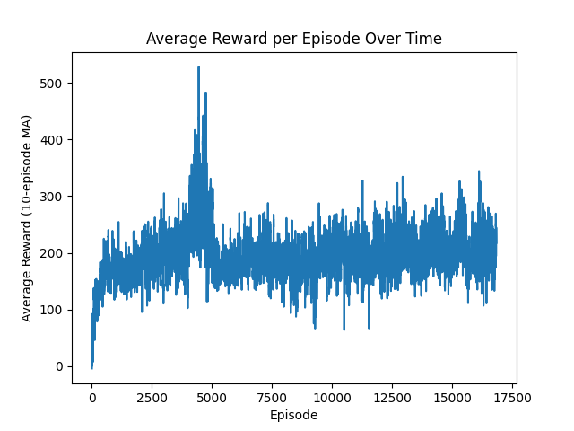
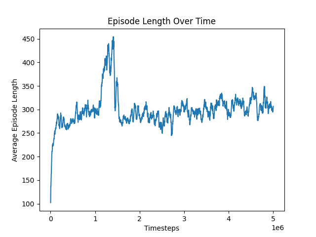
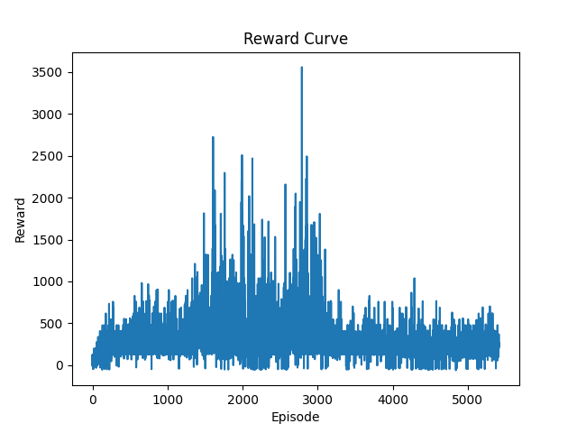
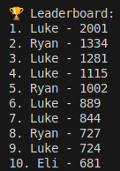

# 🚀 JetpackRL: Reinforcement Learning Jetpack Joyride Clone

JetpackRL is a duck themed procedurally generated infinite runner game inspired by *Jetpack Joyride* and *Flappy Bird*. Built with Pygame and Gym, this project allows both humans and reinforcement learning agents to play and compete. The goal: avoid crashing into obstacles, floor, or ceiling while surviving as long as possible.

Trained using **Stable Baselines3 (PPO)** with a custom **Gymnasium environment**, the AI learns how to time its thrusts to stay alive in an increasingly difficult environment.

---

## 🎮 Gameplay Overview

- Player controls vertical thrust (like Flappy Bird meets Jetpack Joyride)
- Environment scrolls continuously with procedurally generated obstacles
- Crash = game over
- Score = time survived (1 point per frame)

---


## 📊 Features

- ✅ Procedural level generation
- ✅ Pygame environment wrapped as a Gymnasium interface
- ✅ Human play mode with keyboard control
- ✅ Leaderboard system with top scores
- ✅ PPO-trained RL agent using Stable Baselines3
- ✅ Reward visualization and training plots
- ✅ Evaluation mode to test trained agents

---

## 🧠 Agent Design

**Observation Space:**
- Player vertical position
- Player vertical velocity
- Distance to next obstacle
- Gap vertical position
- Gap height
- Vertical distance to gap center

**Action Space:**
- `0`: Do nothing
- `1`: Activate vertical thrust

**Reward Structure:**
- `+1` per frame survived
- `-100` on collision with obstacle, floor, or ceiling

---


## 🏁 Results

### 📈 Average Reward


### 📈 Episode Length


### 📈 Reward Curve



### 🤖 AI vs Human Scores
- Best AI Score: `3500`
- Best Human Score: `2000`



---

## 🛠️ How to Run

### 🔧 Installation
```bash
pip install -r requirements.txt
```

### 🕹️ Play as Human
```bash
python3 -m scripts.play_human
```

### 🤖 Train Agent
Hyperparameters can be adjusted within the file.
```bash
python3 -m scripts.train
```
### 🧪 Evaluate Trained Agent
```bash
python3 -m scripts.evaluate
```

### 🚀 Next Steps

- Understand what is causing the best AI runs by creating a replay system of best performances.

- Create more robust reward systems to incentivize desired behavior.

- Test different RL Algorithms (A2C, DQN, etc.).